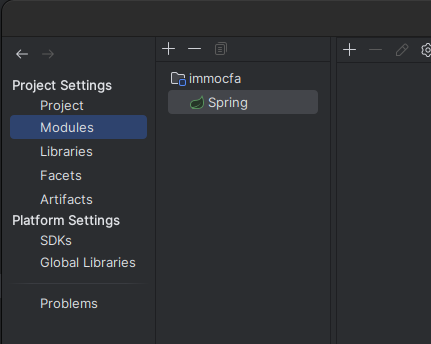

# Construction du projet :
- ````sudo chown -R cd2groupea:cd2groupea ./````
- On crée un Dockerfile
- On crée un docker-compose.yml
- On docker compose up --build
- Notre init dependencies a pas fonctionné donc on le passe dans le terminal :
```docker exec -it immo spring init --dependencies=web,data-jpa,thymeleaf,mariadb,devtools,webflux ./```
- on modifie le build.graddle :
```
  group = 'com.example'
  version = '0.0.1-SNAPSHOT'
```
en
````
  group = 'com.cfa'
  version = ''
````

- On modifie settings gradle:
````
rootProject.name = 'demo'
````
en
````
rootProject.name = 'immo'
````

- on renomme le repository Demo en immo
- on renomme DemoApplication.java en ImmoApplication.java
- on continue la configuration, dans App, nouveau fichier gradle.properties pour le HotReloading
- on continue dans Test, modifier les packages exemple en cfa et demo en immo
- Dans ressources, edit application.properties passer en immo et set spring.datasource.url + bdd config + HotReloading
- notre premier terminal 1 est le docker: 
````docker-compose up````
- dans un nouveau terminal 2 - Lance le serveur: 
````docker exec -it immo ./gradlew bootrun````
- dans un nouveau terminal 3 - lance le HotReload:
````docker exec -it immo ./gradlew build --continuous````
- Facets: créer une liaison pour l'IDE, ce sonts les plugins de Spring 
Sinon passer par Plugins et install Spring
- Maintenant on crée un import dans ImmoApplication = import.org.springframework.stereotype.Controller
- On va déclarer une route afin d'accéder à notre url https://localhost:8181
- On déclare notre premiére route avec @Controller et @RequestMapping("/") dans ImmoApplication
- On se connecte a la base de données via le plugin database fourni avec IntellinJ IDEA Ultimate.
- - On va commencer par definir notre bien ( maison )
- on crée notre classe Bien, puis Agent et Agence
- 

## Pour la Documentation JAVA, https://www.jmdoudoux.fr/java/dej/index.htm

### Sécurité BDD :
- command: --default-authentication-plugin=mysql_native_password

### Pour clear les port si probleme : 
- $sudo lsof -i:8181 
  - $sudo kill -9 PID
- $sudo lsof -i:3314 
  - $sudo kill -9 PID